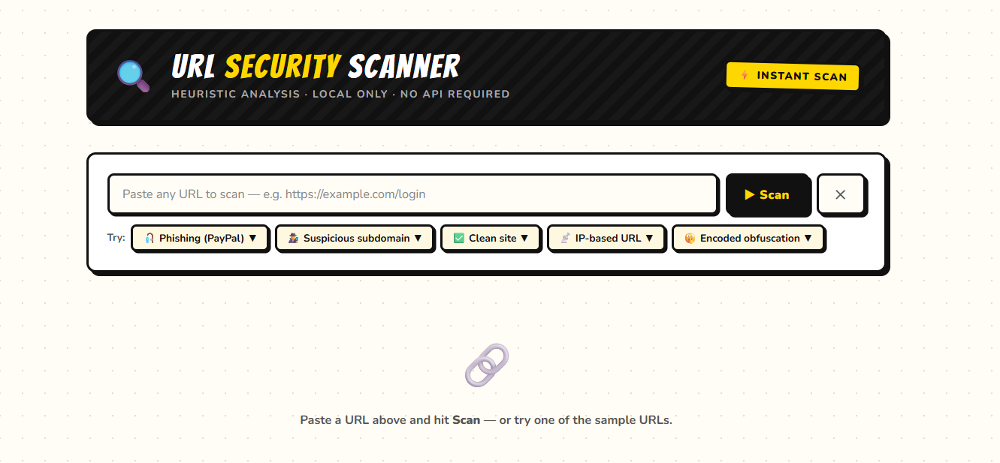
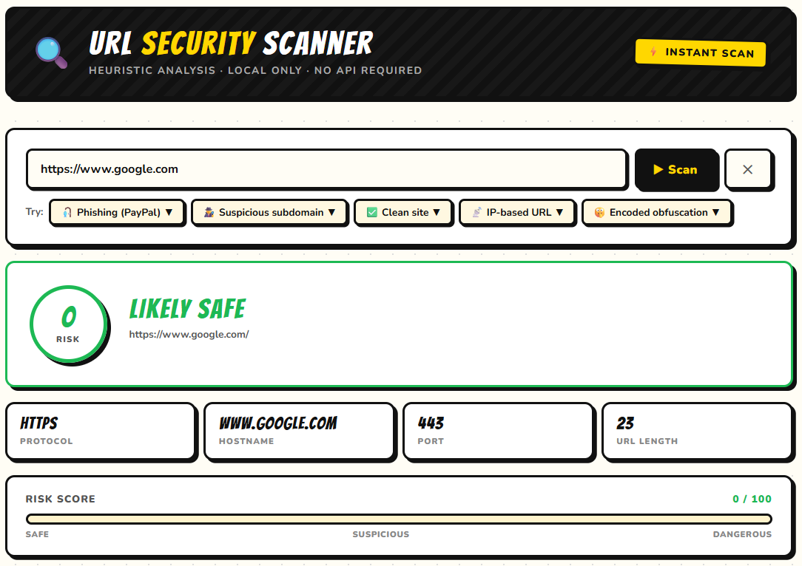
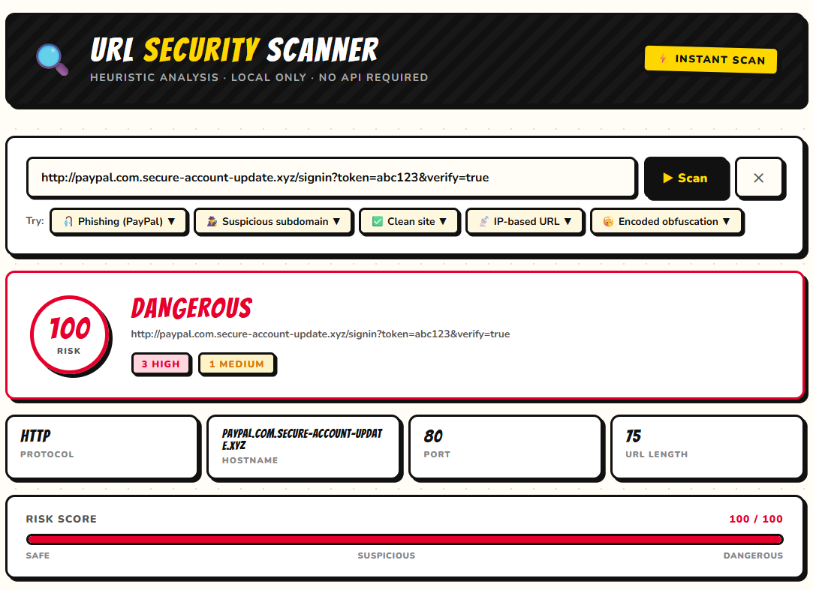
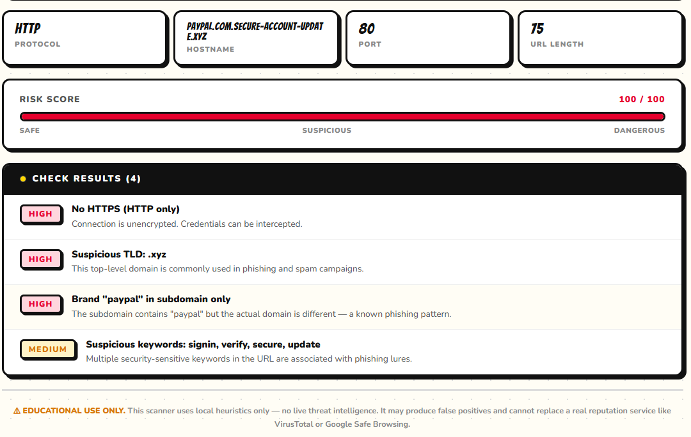

# 🔍 URL Security Scanner & Phishing Detection Tool

> ⚠ Educational Use Only
>
> This tool performs client-side URL analysis inside the browser. No URLs are submitted to external services, databases, or third-party APIs.

An interactive React-based cybersecurity tool that analyzes URLs for common phishing indicators, suspicious domains, typosquatting attempts, URL obfuscation techniques, and social engineering patterns.

The scanner uses a heuristic-based detection engine to identify potentially malicious URLs and explain why they may be dangerous.

---

# 📖 Overview

Cybercriminals frequently use deceptive URLs to trick users into visiting phishing websites, downloading malware, or revealing sensitive information.

This project demonstrates how URL analysis techniques can be used to identify common phishing indicators and suspicious patterns before a user visits a website.

The scanner evaluates URLs using multiple security checks and generates a risk score along with detailed explanations for each detected issue.

---

# ✨ Features

### 🔎 URL Risk Analysis

Analyze URLs for:

- Suspicious Domains
- Typosquatting Attempts
- Homograph Attacks
- Brand Impersonation
- URL Obfuscation
- Redirect Chains
- Suspicious Keywords
- Excessive Subdomains
- High Entropy Domains
- Non-Standard Ports
- Encoded Characters
- IP Address URLs
- Suspicious Top-Level Domains

### 📊 Risk Scoring Engine

Generates:

- Risk Score (0–100)
- Likely Safe Verdict
- Suspicious Verdict
- Dangerous Verdict
- Detailed Detection Results

### 🛡️ Phishing Detection

Detects:

- Brand Spoofing
- Credential Harvesting URLs
- Fake Login Pages
- Banking Phishing Domains
- Social Engineering Indicators

### 📚 Educational Explanations

Every detection includes:

- Why it was flagged
- How attackers use the technique
- Security awareness guidance

---

# 🚩 Detection Techniques

| Detection | Description |
|------------|------------|
| Suspicious TLDs | Common phishing domains such as .xyz, .tk, .pw, .top |
| Typosquatting | Misspelled versions of trusted brands |
| Brand Impersonation | Legitimate brand names hidden inside subdomains |
| Homograph Attacks | Lookalike characters used to mimic trusted domains |
| Excessive Subdomains | Long deceptive domain structures |
| URL Encoding Abuse | Encoded URLs used to hide malicious content |
| Suspicious Keywords | Login, verify, update, account, secure, banking, etc. |
| IP Address URLs | Direct IP usage instead of domain names |
| Redirect Chains | Embedded redirect URLs |
| Entropy Analysis | Machine-generated or random-looking domains |
| Non-Standard Ports | Unusual ports often associated with malicious services |

---

# 🎯 Learning Objectives

This project helps users learn how to:

- Analyze suspicious URLs
- Detect phishing attempts
- Identify typosquatting domains
- Understand URL obfuscation techniques
- Recognize brand impersonation attacks
- Improve phishing awareness
- Develop cybersecurity analysis skills

---

# ⚙️ Technology Stack

- React.js
- JavaScript (ES6+)
- HTML5
- CSS3
- React Hooks

### Detection Engine

- Heuristic-Based Analysis
- URL Parsing
- Levenshtein Distance Matching
- Entropy Analysis
- Domain Reputation Indicators
- Phishing Pattern Recognition

---

# 🚀 Installation

## Clone Repository

```bash
git clone https://github.com/YOUR_USERNAME/url-security-scanner.git
cd url-security-scanner
```

## Install Dependencies

```bash
npm install
```

## Start Development Server

```bash
npm start
```

## Create Production Build

```bash
npm run build
```

---

# 📸 Screenshots

### URL Analysis Dashboard



### Detection Results



### Risk Score Analysis



### Phishing Detection Example



---

# 🎓 Example Use Cases

- Cybersecurity Awareness Training
- Phishing Detection Demonstrations
- Security Education Workshops
- University Coursework
- Information Security Projects
- Threat Analysis Exercises
- Ethical Hacking Training

---

# 📂 Project Structure

```text
url-security-scanner/
│
├── public/
│
├── src/
│   ├── App.js
│   ├── index.js
│   └── URLScanner.jsx
│
├── screenshots/
│   ├── dashboard.png
│   ├── results.png
│   ├── risk-analysis.png
│   └── phishing-example.png
│
├── .gitignore
├── LICENSE
├── README.md
├── package.json
└── package-lock.json
```

---

# ⚠ Disclaimer

This project is intended strictly for educational purposes and cybersecurity awareness training.

The scanner uses heuristic analysis and should not be considered a replacement for professional threat intelligence platforms or enterprise security tools.

Results should be treated as guidance rather than definitive security assessments.

The author assumes no responsibility for misuse of this software.

---

# 👨‍💻 Author

**Charuka Weerasinghe**

Cybersecurity Student | Information Security Enthusiast

---

# 📄 License

Licensed under the MIT License.

Free to use for educational, academic, and cybersecurity awareness purposes.
